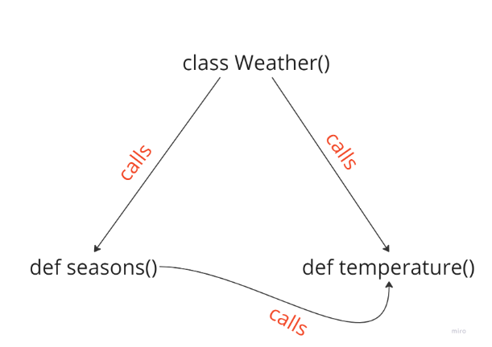
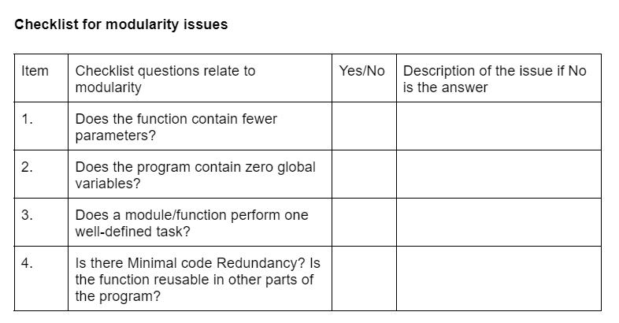
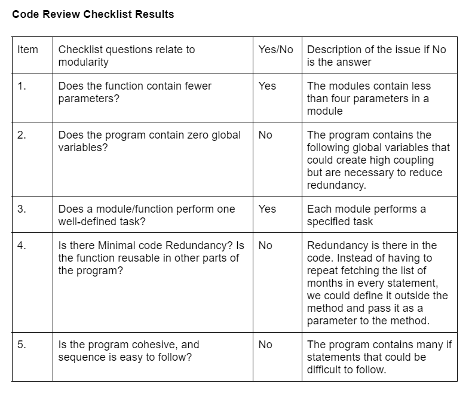
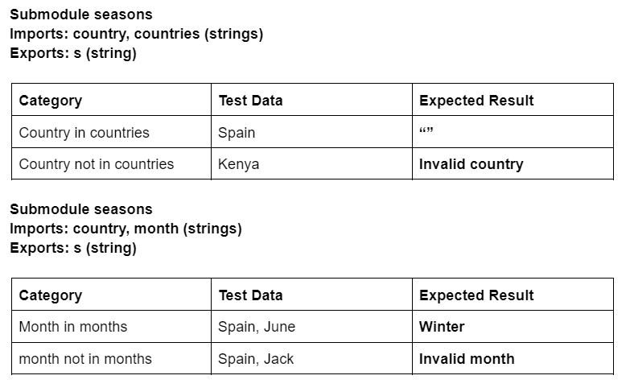
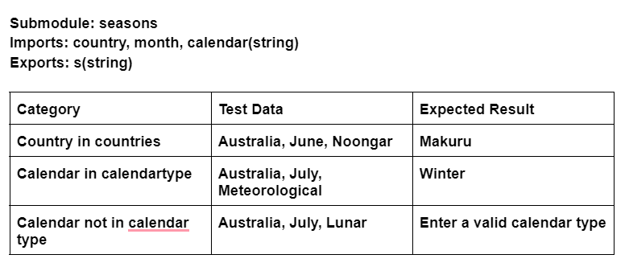
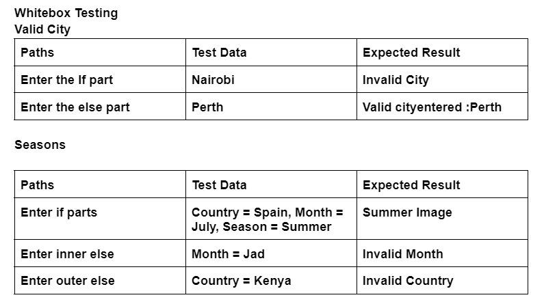
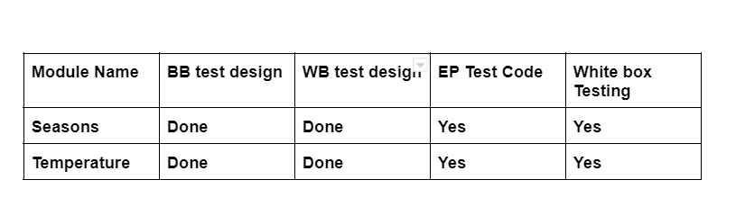
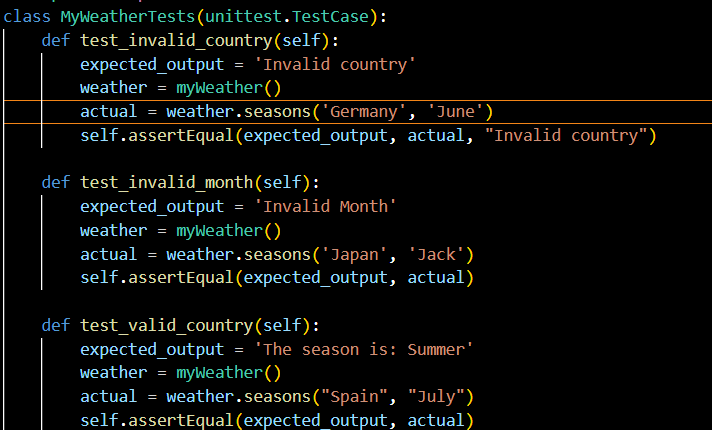
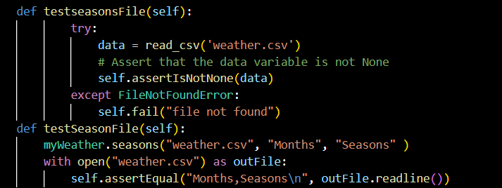
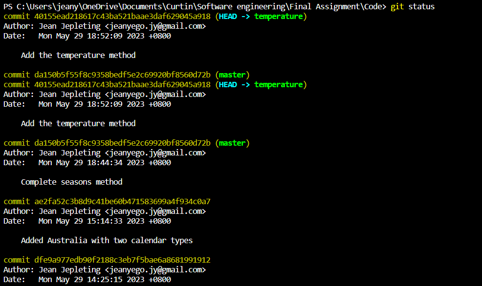

# Cover Page
### Name: Jean Jepleting
### Student ID : 21120374
### Practical Class : Monday, 12-2pm, 314.220
# Introduction
The code implements a weather softeare system that determines the season of a country based on the country name and month. I also includes a temperature module that checks if a given temperature of a city is above or below temperature.
The overview of the code is expalined in the module descriptions.
# Module Descriptions
Weather is a class encompassing two methods, and the methods satisfy the system requirements.

## Def seasons()
This module finds the year's season when the country name and month are given. The module takes inputs in various ways, such as:
 - Taking input from the user
 - Reading from a file
 

The choice of how to take input was based on the usability of the system. To practice concepts such as reading from a file, two countries Japan and Spain were chosen. The rest of the countries took input from the user, and the seasons were stored in objects.
To show the output, images and print text to screen were used. The user gets feedback regarding the season the country is in via a print message and an image plot of the season.

## Def Temperature() 
This module returns the temperature of a city at a given time of day. The two cities are initialised and user input is required to choose the city they would like to know the temperature of. The module prints on screen the temperature of the city and if the temperature is above or below the average temperature at that time of day.
# Modularity
To run the production code, ensure you have downloaded the necessary files required from the folder. The following are the files you will need:
 - seasons.py
 - weather.csv
 - ISEImages folder- containing all the images.
 - Whitebox testing folder - containing white box testing code.
 

Things to consider before running the code include ensuring you have python3 installed and have set up the environment to run python files.
To run the code enter python3 <name of file> on your terminal, ensure you are in the right directory to do this.
## Modularity Concepts
### Code Redundancy
Redundancy is code duplication, having lines of code that perform the same task. It is important to sensibly reuse code. Instead of having to write the code to get the images from the ISEimages folder everytime you'd like to use create a module for images and reuse it everywhere. The only downside is this could create high coupling between modules.
### Cohesion
Cohesion refers to how well a module performs a single task. There are varying degree of cohesion within a module depending on how related the tasks are. For the seasons module, there are several if statements that are used to check the different seasons in different countries. Since the data required my this statements are related there is a high level of coupling. If the if statements depended on different data it would result to low cohesion. To improve cohesion in such a scenario the module would need to be split up to perform the different tasks.
The degree of cohesion in the temperature module is also high. Thus both modules perform their respective tasks well.
### Coupling
Coupling refers to how the different modules interact. Typically we would like to have a low degree of coupling. Things that increase the level of coupling include parameters and return values. One of my modules depends on parameter passing for the user input and has a global variable which could increase coupling.
To reduce coupling, I ensured the parameters passed to a method were sensibly low and were used in unavoidable circumstances. Global variables increase complexity of a module, to reduce redundancy it's best to remove global variables and stick to local method variables. In my seasons midules, countries was removed as a global variable and defined within the method.

### Code Review Checklist

The following is the checklist that I came up with to check for modulatity issues:

Based on the checklist above, I went through my code and was able to answer the questions and see where modularity issues occur within my code.

# Black-box Test Cases
The following are the test cases I came up with:

# White-box Test cases
The following tests are the tests I came up with:

# Test Implementation

The following screenshots show the implementation of the above tests.

# Version Control
Version control was used to keep track of the changes made to this code, the following commands were used:
- git init
- git status
- git global --config user.name
- git global --config user.email
- git commit -m "message"
- git checkout -b temperature
- git push -u origin temperature
- git push -u orign master
- git merge
Here is a screenshot of a sample of git logs:

# Ethics
### Lack of Ethics and Professionalism
Ethics are principles that guide what is right or wrong and professionalism is about doing work correctly and following the standards. If the code written in this assignement is a part of a larger software system, there may be some ethical and proffessional issues. The areas of concern include harm to the public which can be done through:
- Data and Security - If the software requires personal data from the user, this information needs to be secured. If that does not happen and user data gets leaked, this is harmful to the user as their privacy has been violated. It is important to come up with a software that puts a priority on privacy and security.
- Code Quality and standards - The code should be well designed to follow good standards and coding practices. The code implemented in this   projected would still need to be refactored to endure it meets standards. This is important to ensure the larger system is reliable, produces the correct results and soes not harm the users. 
- To ensure the code is considered ethical, ensure proper testing is done, in this assignment more error handling and validation is required to ensure the software produces the correct results.
### ACS or IEEE-CS Ethical guidelines
There are several guidelines to be considered by software engineers, I followed the IEEE-CS guidelines for this part of the assignment.
- Product - Need to ensure the software developed meets the standards, this would include coding practices and need to refactor the code. The code for this simple weather system would be refactored to improve the usability, readability and overall maintainance of the system.
- Self - As a software engineer, one needs to continue learning and improving their skills. This would lead to better skilled professionals capable of writing good ethical software.
- Pubic Interest - Follwoing ethical guidelines require protecting the user from harm, this would include securing personal data that may be used to identify a user. Only storing user data that is required and properly destroying what is not needed.
## Discussion
Despite code refactoring to reduce redundancy, the code could further be modified to be more efficient and increase readability. Separation of modules, or having the data being passed as parameters/ read from file for  all the countries to simplify the implementation process would have been prefered but also could have led to modularity issues.

